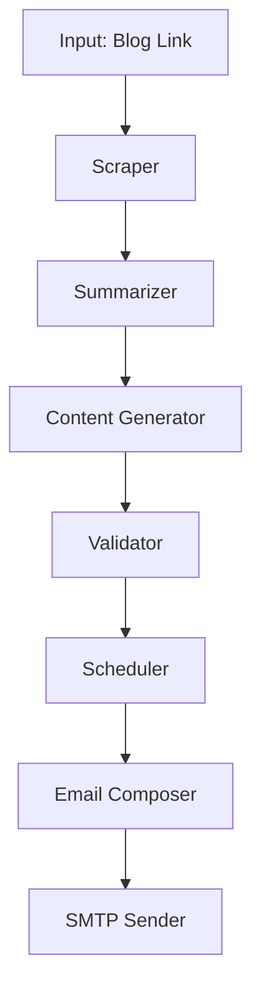

# 📝 Tech Spec – Blog → Social Post Automation Script (LangGraph-based)

## 1. Objective

Automatically generate **LinkedIn** and **X** post drafts from blog content and deliver them to your email inbox.

- **No auto-publishing** → human-in-the-loop for posting.
- **Validation step** ensures posts don’t misrepresent the blog.

---

## 2. Inputs

- **Blog Link** (URL to a scraping-friendly blog).

---

## 3. Outputs

- A single **weekly email** containing:

  - **LinkedIn Monday Post** (teaser, curiosity-driven).
  - **LinkedIn Thursday Post** (directly referencing the blog).
  - **X Daily Posts** (short, punchy posts for each day).

- Validation notes (⚠️) if content seems unsupported by the blog.

---

## 4. Automation Rules

- **LinkedIn**

  - Monday → teaser post (150–200 words, no link).
  - Thursday → blog reference post (200–300 words, includes link).

- **X**

  - Generate 1–3 daily posts (≤280 chars each).

- **Validation**

  - Posts must align with blog facts.
  - Length and format must match platform constraints.

- **Delivery**

  - Email sent every **Sunday night** (to prepare for upcoming week).

---

## 5. Architecture (LangGraph Flow)

---

## 6. Components

### 6.1 Scraper

- **Library**: `requests` + `BeautifulSoup`
- Extract blog title, meta description, and body text.

### 6.2 Summarizer

- **LLM call** (Gemini or OpenAI)
- Generate structured summary (abstract, key insights, hooks).

### 6.3 Content Generator

- **LLM prompts** tuned for:

  - LinkedIn teaser (story-driven, curiosity).
  - LinkedIn reference (informative, includes blog link).
  - X posts (short, punchy insights).

### 6.4 Validator

- **LLM check**: Compare generated posts with blog text.
- **Rule check**: Word count for LinkedIn, char count for X.
- If mismatch → mark ⚠️.

### 6.5 Scheduler

- Assigns posts to correct days (Mon/Thu for LinkedIn, daily for X).

### 6.6 Email Composer

- Formats email with sections: LinkedIn Monday, LinkedIn Thursday, X posts.
- Adds validation notes if needed.

### 6.7 SMTP Sender

- **Library**: `smtplib` (simple Gmail/Yahoo/Outlook SMTP).
- Sends email with subject `Weekly Content Pack – {date}`.

---

## 7. Example Email Output

**Subject:** Weekly Content Pack – Sept 8, 2025

**Body:**

👔 **LinkedIn Monday (Teaser)** ✅ Validated
_"Most people misunderstand SHAP values for Gradient Boosted Trees. Here’s why that matters for explainable AI…"_

👔 **LinkedIn Thursday (Blog Reference)** ⚠️ Needs Review
_"SHAP always gives the true causal effect."_

> ⚠️ The blog does not make this claim. Please edit.

🐦 **X Daily Posts**

1. "Most 'explainability' tools aren’t as objective as they look. SHAP values for GBTs prove it 👇"
2. "Gradient Boosted Trees are powerful, but interpreting them without caution is risky."

---

## 8. Tech Stack

- **Python**

  - `requests`, `beautifulsoup4` → scraping
  - `smtplib` → email
  - `apscheduler` or simple cron → scheduling

- **LangGraph** → Orchestration of nodes
- **LLM API** → Gemini or OpenAI

---

## 9. Limitations

- Script-level → no database, no retries, no scaling.
- Validation depends on LLM consistency.
- Manual posting still required (intended).
